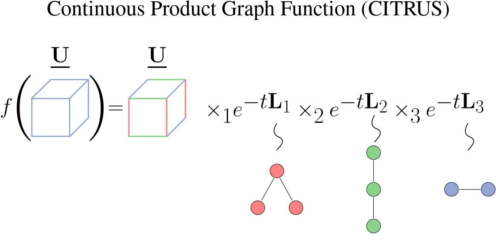

# Continuous Product Graph Neural Networks (CITRUS)

This is the repository of the paper "Continuous Product Graph Neural Networks" published in the thirty-eighth annual Conference on Neural Information Processing Systems (NeurIPS 2024).

**Authors:** [Aref Einizade](https://scholar.google.com/citations?user=ZEQyAaAAAAAJ&hl=en&oi=ao), [Fragkiskos D. Malliaross](https://fragkiskos.me), and [Jhony H Giraldo](https://sites.google.com/view/jhonygiraldo).

- *Remark: A **more organized and completed version** of the implementation codes will be provided soon.* 

## Table of Contents
- [Continuous Product Graph Neural Networks (CITRUS)](#continuous-product-graph-neural-networks-citrus)
  - [Table of Contents](#table-of-contents)
  - [Abstract](#abstract)
  - [Getting Started](#getting-started)
    - [Create a Virtual Environment](#create-a-virtual-environment)
    - [Clone this Repository](#clone-this-repository)
    - [Prerequisites](#prerequisites)
    - [Run the Code](#run-the-code)
  - [Citation](#citation)
  - [Acknowledgements](#acknowledgements)
  - [Contact](#contact)

## Abstract

Processing multidomain data defined on multiple graphs holds significant potential in various practical applications in computer science. However, current methods are mostly limited to discrete graph filtering operations. Tensorial partial differential equations on graphs (TPDEGs) provide a principled framework for modeling structured data across multiple interacting graphs, addressing the limitations of the existing discrete methodologies. In this paper, we introduce Continuous Product Graph Neural Networks (CITRUS) that emerge as a natural solution to the TPDEG. CITRUS leverages the separability of continuous heat kernels from Cartesian graph products to efficiently implement graph spectral decomposition. We conduct thorough theoretical analyses of the stability and over-smoothing properties of CITRUS in response to domain-specific graph perturbations and graph spectra effects on the performance. We evaluate CITRUS on well-known traffic and weather spatiotemporal forecasting datasets, demonstrating superior performance over existing approaches.

---

<div align="center">
    <a href="./">
        
    </a>
</div>

---

## Getting Started

### Create a Virtual Environment

If you have Python's `virtualenv` package installed (through `apt` on Ubuntu), you can make a virtual environment via the following:

```bash
# change your path and name for your virtual env (remove [])
python3 -m virtualenv ~/path/to/virtual/env/storage/[name]

# then source your environment (you need to do this each time you run!)
# again, remove the [] from name
source ~/path/to/virtual/env/storage/[name]
# this should give a nice `([name])` at the beginning of each terminal line
```

### Clone this Repository

```bash
git clone https://github.com/ArefEinizade2/CITRUS.git  
```

### Prerequisites

Our code requires Python >= 3.11.5

You also need the additional packages listed in the [requirements.txt](./requirements.txt) file. You can install the requirements using:

```bash
pip install -r requirements.txt
```

### Run the Code
With the requirements installed, the scripts are ready to be run and used. To have a tutorial general demo about how the CITRUS model works, simply run **CITRUS_demo.ipynb** or:

```bash
python3 CITRUS_demo.py
```

- For analyzing the over-smoothing aspect of the CITRUS, in the Oversmoothing_Analysis folder, run **Oversmoothing_Analysis.ipynb** or:
```bash 
python3 OverSmoothing_Analysis.py
```

- For analyzing the stability aspect of the CITRUS, in the Stability_Analysis folder, run **Stability_Analysis.ipynb**  and **Stability_Analysis_Plot.ipynb** or:
```bash 
python3 Stability_Analysis.py
python3 Stability_Analysis_Plot.py
```

- For generating the results on the MOLENE dataset, in the molene folder, run **Molene_prediction.ipynb** or:
```bash 
python3 Molene_prediction.py
```

- For generating the results on the MetrLA dataset, in the MetrLA_PemsBay folder, run **MetrLA_Github.ipynb** or:
```bash 
python3 MetrLA_Github.py
```

    + *Remark: Note that the proposed CITRUS module has been used in different architectures across synthetic and real-world datasets depending on their downstream learning tasks.*

## Citation
If you use our code, please consider citing our work:

```bash
@inproceedings{
einizade2024continuous,
title={Continuous Product Graph Neural Networks},
author={Aref Einizade and Fragkiskos D. Malliaros and Jhony H. Giraldo},
booktitle={The Thirty-eighth Annual Conference on Neural Information Processing Systems},
year={2024},
url={https://openreview.net/forum?id=XRNN9i1xpi}
}
```

## Acknowledgements
This work was supported by the center [Hi! PARIS](https://www.hi-paris.fr/) and ANR (French National Research Agency) under the JCJC project GraphIA (ANR-20-CE23-0009-01).

- Some segments of the codes heavily rely on the implementation codes of the paper [Graph-time convolutional neural networks: Architecture and theoretical analysis](https://doi.org/10.1109/TPAMI.2023.3311912) and this [Github repo](https://github.com/maysambehmanesh/TIDE).
## Contact
For any query, please contact me at: **aref dot einizade at telecom-paris dot fr**
